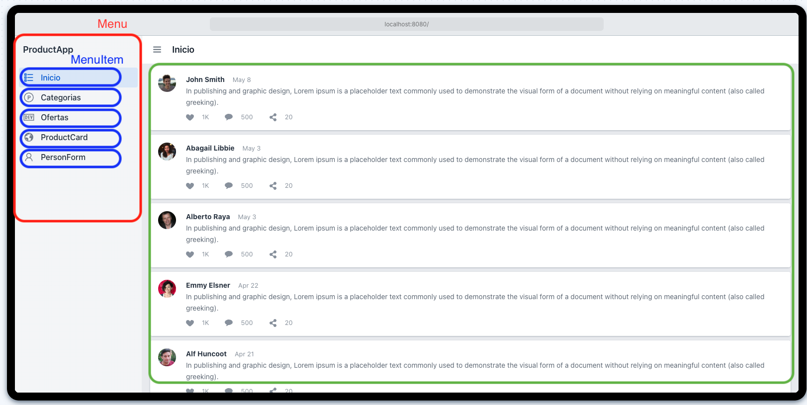
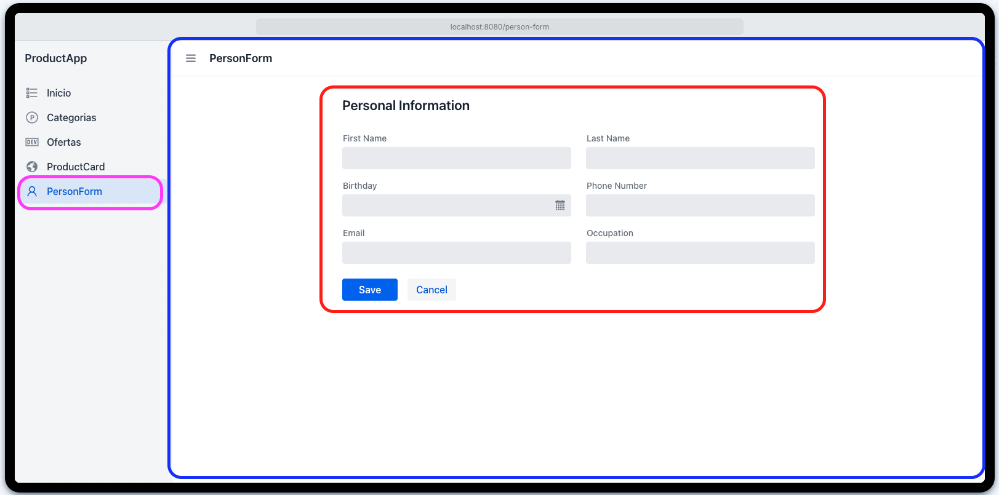

# Introducción a React

## ¿Qué es React?

**React** es una **librería declarativa y eficiente de JavaScript**, orientada a la construcción de interfaces de usuario interactivas. Su diseño permite crear aplicaciones de diversa complejidad, desde soluciones simples hasta sistemas robustos y escalables. Al ser una librería, React puede integrarse de forma directa en archivos HTML, aunque también admite implementaciones modernas mediante herramientas de desarrollo avanzadas.

### Características clave de React:

- **Declaratividad**: Permite describir el estado deseado de la interfaz y React se encarga de actualizar el DOM de manera eficiente.
- **Actualizaciones selectivas del DOM**: Solo se renderizan los elementos que cambian, lo que mejora notablemente el rendimiento de la aplicación.
- **Flujo de datos unidireccional**: La información fluye en una sola dirección, evitando mutaciones impredecibles y facilitando la depuración.
- **Componentes reutilizables**: Las aplicaciones se construyen a partir de módulos encapsulados que pueden mantener su propio estado o ser completamente funcionales.

## Versatilidad de React

React no se limita al desarrollo web en el navegador. Gracias a su ecosistema, también permite:

- Renderizado en el **servidor** utilizando Node.js.
- Creación de **aplicaciones móviles** con React Native.
- Desarrollo de **aplicaciones de escritorio** mediante Electron.

Esta versatilidad permite a los desarrolladores utilizar el mismo enfoque y base de código para distintas plataformas.

## Primer ejemplo: Hola Mundo con React

Se presenta un ejemplo básico para demostrar la sintaxis de React y la utilización de JSX:

```jsx
const divRoot = document.querySelector('#root');

ReactDOM.render(
  <h1>Hola Mundo</h1>,
  divRoot
);
```

- Se obtiene una referencia al elemento HTML con `id="root"`.
- Se utiliza `ReactDOM.render()` para insertar un elemento JSX (`<h1>Hola Mundo</h1>`) en dicho nodo del DOM.

Este ejemplo permite visualizar de forma inmediata el resultado de una aplicación React renderizada en el navegador.

## JSX: JavaScript + XML

JSX es una extensión de sintaxis que combina JavaScript con una sintaxis similar a XML. Permite escribir código de forma declarativa y legible, facilitando la construcción de interfaces.

El siguiente ejemplo en JavaScript puro logra lo mismo que el anterior en JSX:

```javascript
const h1 = document.createElement('h1');
h1.textContent = 'Hola Mundo';
divRoot.appendChild(h1);
```

Este contraste demuestra la eficiencia y simplicidad que ofrece JSX al compararlo con la manipulación directa del DOM.

---

# Primer Proyecto React: Configuración y Primeros Pasos

## Introducción

En esta sección se abordará la creación de una aplicación React desde sus fundamentos, sin el uso de herramientas automatizadas como Vite o Create React App. Este enfoque permite comprender en profundidad el ciclo de vida de una aplicación React y las bibliotecas esenciales involucradas.

## Estructura del Proyecto

1. Crear una carpeta en el escritorio denominada `01-intro-product-app`. Se recomienda mantener una nomenclatura numérica secuencial (01, 02, 03, etc.) para organizar los proyectos de forma ordenada y facilitar su seguimiento.

2. Abrir dicha carpeta en un editor de código (por ejemplo, Visual Studio Code).

3. Generar un archivo `index.html` con la siguiente estructura inicial:

```html
<!DOCTYPE html>
<html lang="es">
  <head>
    <meta charset="UTF-8" />
    <title>React App</title>
  </head>
  <body>
    <div id="root"></div>

    <!-- Inclusión de bibliotecas necesarias -->
    <script src="https://unpkg.com/react@18/umd/react.development.js"></script>
    <script src="https://unpkg.com/react-dom@18/umd/react-dom.development.js"></script>
    <script src="https://unpkg.com/@babel/standalone/babel.min.js"></script>

    <!-- Código React personalizado -->
    <script type="text/babel">
      const productName = "Zapatos deportivos";
      const h1Tag = <h1>Hola, este es el producto: {productName}</h1>;

      const divRoot = document.querySelector("#root");
      ReactDOM.render(h1Tag, divRoot);
    </script>
  </body>
</html>
```

## Desglose del Código

- **Babel**: Esta herramienta transforma código JSX en JavaScript convencional comprensible por cualquier navegador. Aunque no se utiliza así en entornos productivos, resulta muy útil para fines educativos.
- **React** y **ReactDOM**: Son las bibliotecas clave para construir interfaces y renderizarlas eficientemente en el DOM.
- **Elemento **``** con id **``: Actúa como el contenedor principal donde se montará la interfaz de usuario React.

## Renderizado de Variables con JSX

React permite incorporar variables dentro del código JSX utilizando llaves `{}`. Por ejemplo:

```jsx
const productName = "Zapatos deportivos";
<h1>Hola, este es el producto: {productName}</h1>
```

Durante el renderizado, React reemplazará automáticamente `productName` por su valor correspondiente.

## Recomendaciones de Buenas Prácticas

- Se sugiere finalizar todas las sentencias con punto y coma `;` para evitar ambigüedades durante la interpretación del código.
- Familiarizarse con los atajos del navegador para acceder a las herramientas de desarrollo (por ejemplo: `Ctrl + Shift + I` o `F12`) facilita la detección de errores.

## Resultado Esperado

Al abrir el archivo `index.html` en el navegador, se debería visualizar el siguiente mensaje en pantalla:

```
Hola, este es el producto: Zapatos deportivos
```

La correcta visualización del mensaje indica que el entorno React ha sido configurado adecuadamente.

---

# Conceptos Fundamentales en React: Componentes y Estado

## Introducción

Antes de iniciar el desarrollo de aplicaciones con React, es esencial comprender dos conceptos clave: **los componentes** y **el estado**. Estos elementos constituyen la base del modelo de desarrollo de React y permiten construir interfaces modulares, reactivas y reutilizables de forma eficiente.

---

## ¿Qué es un Componente?

Un **componente** es una unidad encapsulada de código que representa una sección específica de la interfaz de usuario. En React, los componentes pueden reutilizarse, combinarse y anidarse para construir estructuras complejas manteniendo una alta cohesión y bajo acoplamiento.

### Características principales:
- Reutilizables y testables.
- Pueden contener estado o ser completamente funcionales.
- Permiten estructurar la interfaz de forma jerárquica y escalable.

### Ejemplo visual de estructura de componentes:

A continuación, se presenta una interfaz simulada de una aplicación de productos que ilustra la composición jerárquica típica en React:



En esta interfaz:
- `ProductApp` es el componente raíz que encapsula la estructura general.
- `MenuItem` representa cada elemento de navegación lateral.
- Al seleccionar una opción como `ProductCard` o `PersonForm`, React renderiza el componente correspondiente en el área principal sin recargar la página.

---

## ¿Qué es el Estado?

El **estado** (state) en React representa la información dinámica que maneja un componente. Esta información puede modificarse a lo largo del tiempo como resultado de interacciones del usuario o eventos del sistema.

### Ejemplo práctico con formulario:



En este caso:
- El componente `PersonForm` es responsable de capturar y gestionar la información del usuario.
- Al iniciarse, el estado del formulario está vacío.
- A medida que se completan los campos (`First Name`, `Last Name`, `Email`, etc.), el estado del componente se actualiza.
- Estas actualizaciones son gestionadas por React para reflejar los cambios en la interfaz de manera inmediata y eficiente.

### Beneficios del estado:
- Permite mantener sincronización entre la interfaz visual y los datos del componente.
- Habilita comportamientos dinámicos y reactividad frente a eventos del usuario.

---

## Conclusión

Comprender a fondo los conceptos de **componentes** y **estado** es esencial para desarrollar aplicaciones modernas con React. Los componentes promueven la reutilización, el orden y la mantenibilidad del código, mientras que el estado permite construir interfaces dinámicas, interactivas y reactivas. En la siguiente etapa se aplicarán estos conocimientos fundamentales en el desarrollo práctico de una aplicación funcional con React.

---

# Creación del Primer Componente en React

## Introducción

En esta sección se da continuidad al desarrollo de una aplicación React, estructurando correctamente el primer componente funcional en un archivo independiente. Se abordan principios de organización del proyecto, convenciones para exportación e importación de componentes, y se destaca la eficiencia del entorno de desarrollo proporcionado por Vite.

---

## Organización del Proyecto

Aunque es posible definir la lógica principal directamente en `main.jsx`, se recomienda trasladar los componentes a archivos independientes para mejorar la legibilidad, escalabilidad y mantenimiento del código. Es una práctica ampliamente adoptada en proyectos profesionales.

Una estructura mínima sugerida sería:

```bash
src/
├── main.jsx
└── HelloWorldApp.jsx
```

---

## Definición del Componente `HelloWorldApp`

El archivo `HelloWorldApp.jsx` contendrá un componente funcional básico. Existen dos enfoques válidos para su exportación:

**Exportación nombrada:**
```jsx
export function HelloWorldApp() {
  return <h1>Hello World App</h1>;
}
```

**Exportación por defecto:**
```jsx
export default function HelloWorldApp() {
  return <h1>Hello World App</h1>;
}
```

La elección entre estos enfoques depende de las necesidades del proyecto y del estilo preferido por el equipo de desarrollo.

---

## Importación del Componente

Desde `main.jsx`, se realiza la importación del componente y su posterior renderizado en el DOM:

```jsx
import React from 'react';
import ReactDOM from 'react-dom/client';
import { HelloWorldApp } from './HelloWorldApp'; // o 'default' si aplica

ReactDOM.createRoot(document.getElementById('root')).render(
  <React.StrictMode>
    <HelloWorldApp />
  </React.StrictMode>
);
```

---

## Consideraciones sobre Exportaciones

- **Exportaciones nombradas**: permiten una mayor granularidad y reutilización.
- **Exportaciones por defecto**: facilitan la importación cuando se exporta un único valor principal desde un archivo.

Ambos enfoques son funcionales; su elección debe priorizar la claridad, mantenibilidad y consistencia del código base.

---

## Ventajas del Desarrollo con Vite

Vite proporciona una experiencia de desarrollo sumamente eficiente gracias a la recarga en caliente (_Hot Module Replacement_). Al guardar un archivo, los cambios se reflejan automáticamente en el navegador, sin necesidad de recargar manualmente.

### Ejemplo práctico:

```jsx
return <h1>¡Mi primer componente en React!</h1>;
```

Al modificar el texto y guardar el archivo, el resultado se actualiza de inmediato en la interfaz.

---

## Componentes Funcionales y Sintaxis Moderna

Es posible definir componentes React utilizando funciones tradicionales o funciones de flecha. El siguiente ejemplo demuestra el uso de una función de flecha, habitual en desarrollos contemporáneos:

```jsx
const HelloWorldApp = () => {
  return <h1>Arrow Function Component</h1>;
};
```

Este patrón es recomendable por su sintaxis concisa y su compatibilidad con otras características modernas de React, como hooks y lógica declarativa.

---

## Conclusión

Se ha implementado exitosamente un componente funcional básico en React, cumpliendo con las buenas prácticas de modularidad y organización del código. Asimismo, se han explorado diferentes formas de exportación e importación de componentes, y se ha destacado el valor de herramientas como Vite en el proceso de desarrollo moderno. Este componente servirá como base para futuras ampliaciones en la arquitectura de la aplicación.


---

# Uso de Fragmentos en React: Agrupación de Elementos sin Etiquetas Adicionales

## Introducción

En esta sección se aborda una característica fundamental de React: el uso de **fragmentos** para estructurar múltiples elementos JSX sin la necesidad de introducir nodos HTML adicionales en el DOM. Esta práctica permite una representación más limpia y semántica del código, evitando interferencias en el diseño y mejorando el rendimiento general.

---

## El Problema: Múltiples Elementos sin Nodo Padre

Cuando un componente React intenta retornar múltiples elementos hermanos (por ejemplo, un `<h1>` seguido de un `<p>`) sin un contenedor común, se produce un error de sintaxis, comúnmente reportado como: *"JSX expressions must have one parent element"*.

### Ejemplo no válido:
```jsx
return (
  <h1>Título</h1>
  <p>Subtítulo</p>
);
```

Este enfoque es inválido ya que React requiere que cada componente devuelva un único nodo raíz.

---

## Solución 1: Envolver en un `div`

Una solución inicial consiste en encapsular los elementos dentro de una etiqueta `div`:

```jsx
return (
  <div>
    <h1>Título</h1>
    <p>Subtítulo</p>
  </div>
);
```

Aunque funcional, esta práctica puede introducir nodos HTML innecesarios que afectan el diseño (por ejemplo, en estructuras Flexbox) o el rendimiento.

---

## Solución 2: Uso de `Fragment` de React

React ofrece el componente `Fragment`, que permite agrupar elementos JSX sin generar nodos adicionales en el DOM:

```jsx
import { Fragment } from 'react';

return (
  <Fragment>
    <h1>Título</h1>
    <p>Subtítulo</p>
  </Fragment>
);
```

Este enfoque mantiene la estructura limpia del DOM, evitando etiquetas HTML superfluas.

---

## Solución 3: Sintaxis Abreviada de Fragmentos

Como alternativa al uso explícito de `Fragment`, React permite utilizar una sintaxis más concisa:

```jsx
return (
  <>
    <h1>Título</h1>
    <p>Subtítulo</p>
  </>
);
```

Esta sintaxis representa la forma más recomendada y moderna para agrupar elementos sin nodos adicionales.

---

## Ventajas del Uso de Fragmentos

- Elimina la introducción de nodos HTML innecesarios.
- Mejora la semántica del código y la estructura del DOM.
- Optimiza el rendimiento de renderizado.
- Facilita la organización de componentes con múltiples elementos hermanos.

---

## Buenas Prácticas en JSX

- Todo componente React debe retornar un único nodo raíz.
- En caso de múltiples elementos al mismo nivel, se recomienda utilizar fragmentos.
- Evitar el uso de `div` innecesarios que puedan alterar el diseño o dificultar la interpretación del código.

---

## Conclusión

El uso de **fragmentos en React** es una herramienta esencial para estructurar componentes de forma eficiente, elegante y semánticamente correcta. Permite agrupar múltiples elementos sin sobrecargar el DOM con etiquetas innecesarias, favoreciendo la claridad del código y el rendimiento de la aplicación. Esta técnica constituye una práctica estándar en el desarrollo moderno con React.


---


# Estilos Globales en React: Integración y Buenas Prácticas

## Introducción

En esta sección se presenta la forma adecuada de aplicar estilos globales en una aplicación React, permitiendo personalizar la apariencia de todos los componentes desde un único punto central. React es agnóstico en cuanto a las herramientas de estilizado, ofreciendo flexibilidad para emplear bibliotecas como Tailwind, Material UI, Styled Components, entre otros. En este caso, se aborda una estrategia básica utilizando hojas de estilo CSS tradicionales.

---

## Creación de un Estilo Global

El primer paso consiste en crear una hoja de estilos dentro del directorio `src`. El nombre del archivo puede ser arbitrario (por ejemplo, `index.css` o `global.css`), siempre que tenga la extensión `.css`. A continuación, se define un conjunto básico de reglas globales de estilo:

```css
html, body {
  background-color: #21232a;
  color: white;
  font-family: Helvetica, Arial, sans-serif;
  font-size: 1.3rem;
  padding: 70px;
}
```

Estas reglas establecen un color de fondo, tipografía base, tamaño de fuente y espaciado general para toda la aplicación.

---

## Importación del Estilo Global en la Aplicación

Una vez creado el archivo CSS, es indispensable importarlo explícitamente para que surta efecto en la aplicación. Esta importación debe realizarse en el punto de entrada principal, habitualmente el archivo `main.jsx` o `main.tsx`, de la siguiente manera:

```js
import './index.css';
```

Esto asegura que los estilos definidos se apliquen globalmente a todos los componentes renderizados por la aplicación.

---

## Ventajas del Enfoque

- **Simplicidad**: Permite comenzar rápidamente sin configuración adicional.
- **Compatibilidad**: Funciona con cualquier herramienta de bundling como Vite o Webpack.
- **Eficiencia**: Los cambios se reflejan inmediatamente gracias al hot reload de Vite.

---

## Recomendaciones Adicionales

- Se puede organizar y ordenar alfabéticamente las reglas CSS para mejorar la legibilidad y mantenimiento del código.
- Es recomendable emplear `rem` en lugar de `px` para facilitar la adaptabilidad a distintos tamaños de pantalla.

---

## Conclusión

Aplicar estilos globales en React es un paso esencial para establecer una base visual coherente en toda la aplicación. Utilizar una hoja de estilos centralizada permite controlar la estética de manera sencilla y eficaz. A medida que el proyecto evoluciona, es posible integrar enfoques más avanzados como CSS Modules, Styled Components o CSS-in-JS según los requerimientos del equipo de desarrollo.

Esta técnica representa una práctica recomendada para proyectos en etapas iniciales o prototipos rápidos, y constituye la base para comprender mecanismos de estilizado más sofisticados en el ecosistema de React.
